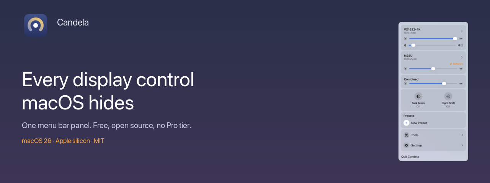
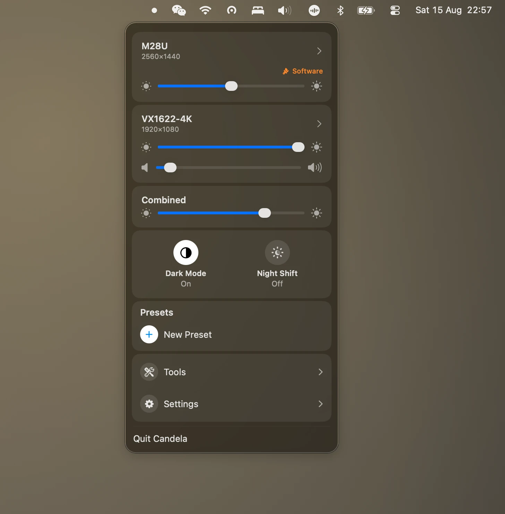
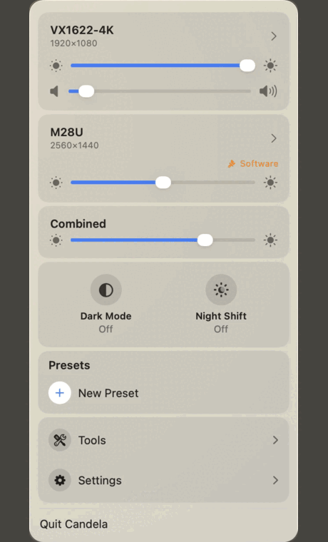

<div align="center">



# Candela

**Every display control macOS hides, in one menu bar panel.**

Free, open-source control for external monitors on macOS: sharp HiDPI scaling,
DDC brightness, brightness keys that work on any display, presets and virtual screens.

[](https://github.com/iamzifei/Candela/releases/latest/download/Candela.dmg)

[](#requirements)
[](#requirements)
[](LICENSE)
[](https://github.com/iamzifei/Candela/releases)

[Website](https://zifei.info/Candela/) ·
[Compare with BetterDisplay & Lunar](https://zifei.info/Candela/candela-vs-betterdisplay.html) ·
[Guides](https://zifei.info/Candela/fix-blurry-external-monitor-macos.html) ·
**[中文](README.zh-Hans.md)**

</div>

---

Plug a monitor into a Mac and three things stop working the way they do on the
built-in display. The brightness keys adjust nothing. The resolution list offers a
handful of blurry options and hides the sharp ones. And there is no way to move every
display at once. Candela puts all three back.



<div align="center">



</div>

## Install

```sh
brew install --cask iamzifei/tap/candela
```

Or [download the DMG](https://github.com/iamzifei/Candela/releases/latest/download/Candela.dmg)
and drag Candela to Applications. Signed with a Developer ID and notarised by Apple,
so it opens without right-click warnings.

## Features

**Brightness that reaches the backlight.** DDC/CI over the video cable — the same
channel the monitor's own buttons use. Displays that refuse DDC fall back to gamma
dimming, and the panel marks them **Software** so you can tell which you are getting.

**Brightness keys on any display.** F1 and F2 can follow the pointer, drive every
display, drive them all as one, or drive only the ones you pick.

**Sharp HiDPI scaling.** The 2×-rendered modes macOS hides on third-party monitors,
so a 1440p or 4K panel can be readable *and* sharp instead of one or the other.

**Displays that match each other.** One slider for the whole desk, plus a per-display
floor you calibrate by eye — because sending two panels the same percentage does not
make them emit the same light, and at the bottom of the range one goes black while its
neighbour is still lit.

**And:** resolution and refresh rate, display arrangement, colour profiles, presets,
virtual displays, iPad via Sidecar, HDR and extra brightness, DDC volume, keep-awake,
Dark Mode and Night Shift toggles.

Interface in English, 简体中文 and 繁體中文.

## How does it compare?

BetterDisplay has the deepest feature set and charges $21.99 for the parts most people
want, including flexible HiDPI scaling. Lunar is the best at automatic brightness and
charges $23, with the free build capped at 100 adjustments a day. Candela does the core
job of both and gives every feature away, at the cost of being narrower — macOS 26,
Apple silicon, no automation engine.

[Full comparison, including what Candela does not do →](https://zifei.info/Candela/candela-vs-betterdisplay.html)

## Requirements

- macOS 26 or later
- Apple silicon
- For hardware brightness on an external display: DDC/CI enabled in the monitor's own
  on-screen menu. Most monitors ship with it on; a few, and some USB-C docks, do not
  pass the channel through

## Permissions

- **Accessibility** — only if you turn on Brightness Keys, which is what lets Candela
  see a key press before macOS consumes it. Everything else works without it.
- **Administrator password** — once per monitor, only when you turn on smooth scaling.
  It installs a display override into `/Library/Displays/Contents/Resources/Overrides`,
  which macOS protects. Nothing else asks for it.

## Support

Candela is and will stay completely free — no Pro tier, no licence key, no limits. Its
one running cost is the $99/year Apple Developer Program, which is what makes signing
and notarising possible so the app installs without warnings.

- [GitHub Sponsors](https://github.com/sponsors/iamzifei)
- [Ko-fi](https://ko-fi.com/iamzifei)
- [爱发电 (Afdian)](https://ifdian.net/a/iamzifei)

Entirely optional. Nothing in the app changes either way.

## Building

```sh
brew install xcodegen
xcodegen generate   # generates Candela.xcodeproj from project.yml
open Candela.xcodeproj
```

For the fast edit-compile-run loop (Command Line Tools only, no full Xcode) and for
building a distributable DMG, see [docs/BUILDING.md](docs/BUILDING.md).

The website in `docs/` is generated — edit `site/content/`, then run
`python3 site/build.py`.

## Contributing

Issues and pull requests are welcome. Found a bug, want a feature, or have a display
Candela handles badly? [Open an issue](https://github.com/iamzifei/Candela/issues) or
start a [discussion](https://github.com/iamzifei/Candela/discussions). Translations are
as welcome as code.

## Origin

Candela is a fork of [Crisp](https://github.com/didriksg/Crisp) by Didrik Galteland,
which is itself descended from [FreeDisplay](https://github.com/huberdf/FreeDisplay).
Since the fork it has been narrowed to macOS 26, rebuilt around drill-down pages
instead of nested disclosure sections, and reworked through the brightness pipeline —
but the foundation is Crisp's, and the spirit is FreeDisplay's: display management that
is free for everyone.

## License

[MIT](LICENSE). Portions derived from Crisp and FreeDisplay remain available under
their MIT terms, reproduced in [ACKNOWLEDGMENTS.md](ACKNOWLEDGMENTS.md).
