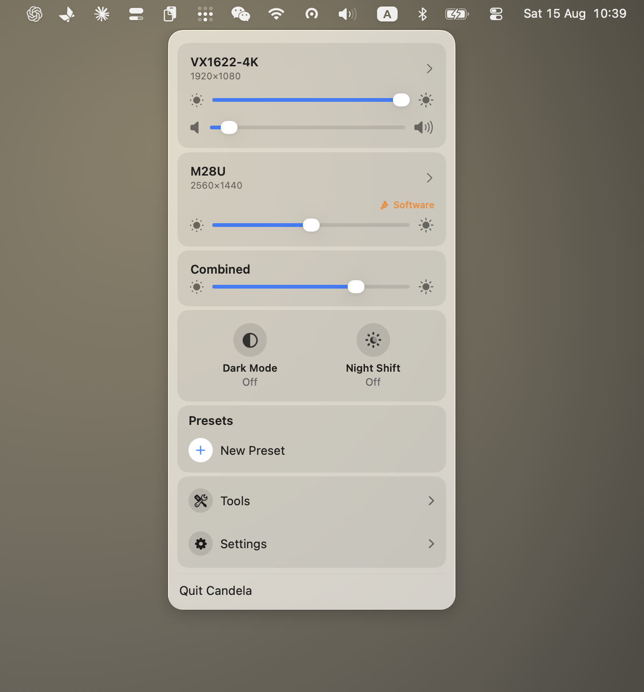

<div align="center">


# Candela

**macOS 藏起来的显示器设置，都在这一个菜单栏面板里。**

免费开源的 macOS 外接显示器控制工具：清晰的 HiDPI 缩放、DDC 硬件亮度、
能作用于任意屏幕的亮度快捷键、预设与虚拟显示器。

[](https://github.com/iamzifei/Candela/releases/latest/download/Candela.dmg)

[](#系统要求)
[](#系统要求)
[](LICENSE)

[官网](https://iamzifei.github.io/Candela/zh/) ·
[与 BetterDisplay、Lunar 对比](https://iamzifei.github.io/Candela/zh/candela-vs-betterdisplay.html) ·
[使用指南](https://iamzifei.github.io/Candela/zh/fix-blurry-external-monitor-macos.html) ·
**[English](README.md)**

</div>

---

把显示器插到 Mac 上，有三件事立刻不像内置屏那样正常了：亮度键按下去毫无反应；
分辨率列表只给几个发虚的选项，把清晰的那些藏了起来；想把整张桌子调暗，
只能一块屏一块屏地拖。Candela 把这三件事补回来。



## 安装

```sh
brew install --cask iamzifei/tap/candela
```

或者[下载 DMG](https://github.com/iamzifei/Candela/releases/latest/download/Candela.dmg)
拖进「应用程序」。使用 Developer ID 签名并经过 Apple 公证，
打开时不会有「无法验证开发者」的拦截。

## 功能

**调的是背光，不是画面。** 走视频线上的 DDC/CI，和显示器自己的按键是同一条通道。
拒绝 DDC 的显示器会退回 gamma 调光，并在面板上标出 **Software**，
让你清楚现在用的是哪一种。

**亮度键作用于任意屏幕。** F1／F2 可以跟随鼠标、作用于全部屏幕、
把所有屏幕当成一个整体，或只作用于你指定的那几块。

**清晰的 HiDPI 缩放。** 把 macOS 对第三方显示器隐藏的 2× 渲染档位放出来，
让 1440p 或 4K 面板既看得清、又足够锐利，而不是二选一。

**让多块屏真的看起来一样。** 一条滑条管住整张桌子，
再加上每块屏可用眼睛校准的下限——因为把同一个百分比发给两块面板，
它们发出的光并不相同，在最低端会出现一块已经全黑、另一块还亮着。

**以及：** 分辨率与刷新率、显示器排列、色彩描述文件、预设、虚拟显示器、
iPad Sidecar、HDR 与额外亮度、DDC 音量、防休眠、深色模式与 Night Shift 开关。

界面支持 English、简体中文、繁體中文。

## 和同类工具比

BetterDisplay 功能最全，但大多数人真正想要的那几项（包括灵活 HiDPI 缩放）
在 21.99 美元的 Pro 里。Lunar 的自动亮度做得最好，终身授权 23 美元，
免费版每天限 100 次调节。Candela 把两者的核心功能都做了并全部免费，
代价是做得更窄——只支持 macOS 26 与 Apple 芯片，没有自动化引擎。

[完整对比，包括 Candela 做不到的部分 →](https://iamzifei.github.io/Candela/zh/candela-vs-betterdisplay.html)

## 系统要求

- macOS 26 或更新
- Apple 芯片
- 外接显示器的硬件亮度需要在显示器自身的 OSD 菜单里开启 DDC/CI。
  多数显示器出厂即开启；少数机型以及部分 USB-C 扩展坞不透传该通道

## 权限

- **辅助功能** —— 仅在你启用亮度键时需要，它让 Candela 能在 macOS 消费掉按键之前看到它。
  其余功能不需要这个权限也能用。
- **管理员密码** —— 每台显示器一次，仅在开启平滑缩放时需要。
  它会向 `/Library/Displays/Contents/Resources/Overrides` 写入一个显示覆盖文件，
  那个目录受 macOS 保护。其他任何操作都不会要求它。

## 支持这个项目

Candela 现在免费，以后也会一直免费——没有 Pro 版、没有激活码、没有任何限制。
它唯一的持续成本是每年 99 美元的 Apple 开发者计划，
正是它让签名与公证成为可能，你安装时才不会看到警告。

- [GitHub Sponsors](https://github.com/sponsors/iamzifei)
- [Ko-fi](https://ko-fi.com/iamzifei)
- [爱发电](https://ifdian.net/a/iamzifei)

完全自愿。给或不给，app 都不会有任何区别。

## 构建

```sh
brew install xcodegen
xcodegen generate   # 从 project.yml 生成 Candela.xcodeproj
open Candela.xcodeproj
```

快速的「改—编译—跑」循环（只需命令行工具，不需要完整 Xcode）以及打包 DMG 的方式，
见 [docs/BUILDING.md](docs/BUILDING.md)。

`docs/` 下的网站是生成的——改 `site/content/`，然后运行 `python3 site/build.py`。

## 参与

欢迎 issue 和 PR。发现 bug、想要某个功能，或者有 Candela 处理得不好的显示器？
[提 issue](https://github.com/iamzifei/Candela/issues) 或者开一个
[discussion](https://github.com/iamzifei/Candela/discussions)。
翻译和代码一样欢迎。

## 来源

Candela fork 自 Didrik Galteland 的 [Crisp](https://github.com/didriksg/Crisp)，
而 Crisp 又源自 [FreeDisplay](https://github.com/huberdf/FreeDisplay)。
fork 之后它被收窄到 macOS 26，面板从嵌套折叠改成了下钻页面，
亮度链路也重做了一遍——但地基是 Crisp 的，
而精神是 FreeDisplay 的：让所有人都能免费管理自己的显示器。

## 许可

[MIT](LICENSE)。源自 Crisp 与 FreeDisplay 的部分仍按其 MIT 条款提供，
全文见 [ACKNOWLEDGMENTS.md](ACKNOWLEDGMENTS.md)。
